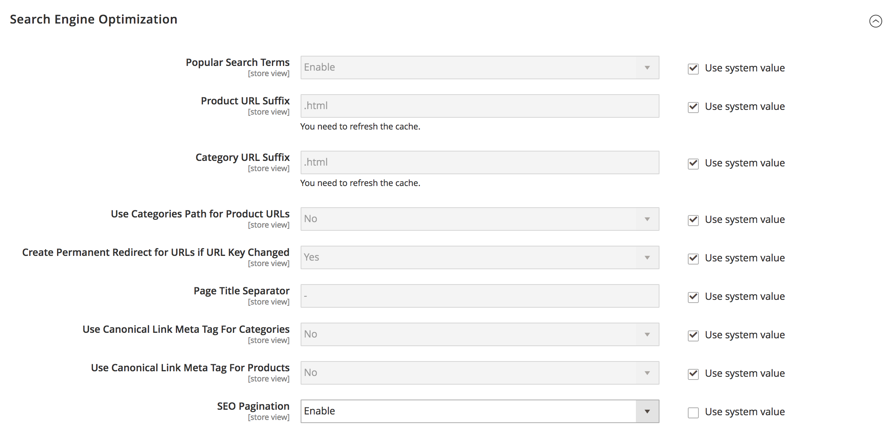

# Magento 2 SEO: Pagination

https://github.com/drewdhunter/SeoPagination

### Introduction
It’s important to include the rel=”prev” & rel=”next” meta tags in your eCommerce site.
For more information about these meta tags can be founded [here](http://googlewebmastercentral.blogspot.co.uk/2011/09/pagination-with-relnext-and-relprev.html)

This is Magento 2 extension adds these meta tags into you category pages. 

### Installation
The preferred way of installing lillik/module-seo-pagination is through Composer. 
Simply add lillik/module-seo-pagination as a dependency:

```bash
php composer.phar require lillik/module-seo-pagination
```

### Configuration

```
Stores -> Configuration -> Catalog -> Search Engine Optimization
```


### Contribution
If you have any issues, please [contact me](https://twitter.com/clipro) or open a bug report in GitHub's [issue tracker](https://github.com/lillik/module-seo-pagination/issues).

### License
The code is licensed under [Apache-2.0 License](https://www.apache.org/licenses/LICENSE-2.0).
